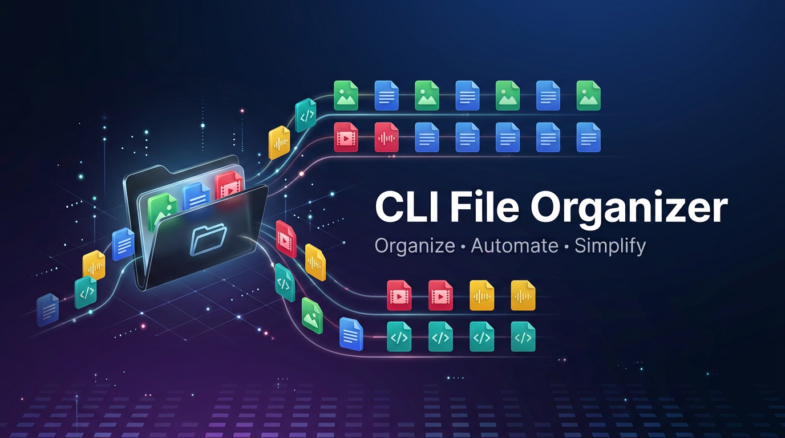
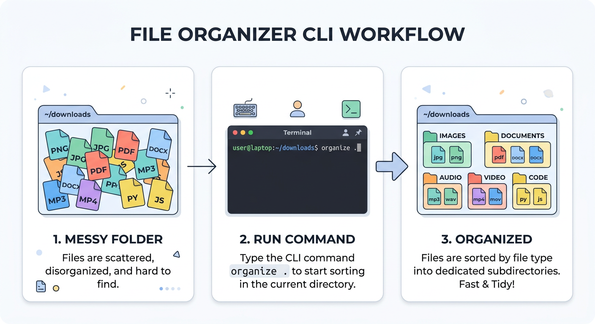
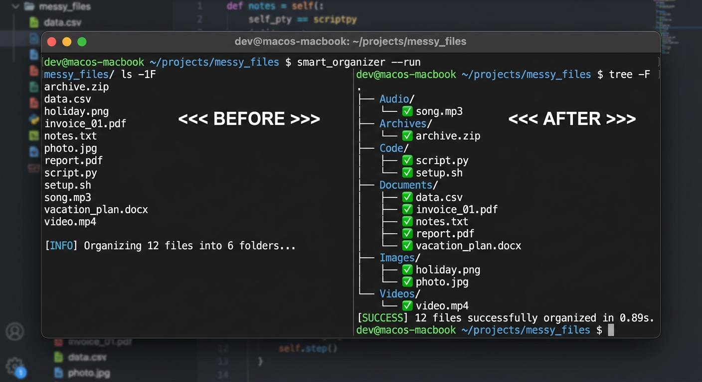

<div align="center">



# 📁 CLI File Organizer

### Organize • Automate • Simplify

[](https://www.python.org/)
[](LICENSE)
[](https://github.com/AryanJaiswara07/cli-file-organizer/actions/workflows/tests.yml)
[](http://makeapullrequest.com)
[](https://github.com/AryanJaiswara07/cli-file-organizer/stargazers)

A powerful, zero-dependency Python CLI tool that organizes messy folders by automatically sorting files into categorized subfolders based on their extensions. **With undo support, you can never go wrong!**

[🚀 Quick Start](#-quick-start) • [📖 Usage](#-usage) • [🎬 Demo](#-demo) • [🛠️ Development](#-development)

</div>

---

## ✨ Features

<table>
<tr>
  <td>🗂️ <b>10 Smart Categories</b><br/>Images, Documents, Videos, Audio, Archives, Code, Fonts, Executables, Data, and Others</td>
  <td>🔍 <b>Dry-Run Mode</b><br/>Preview what will happen before moving any files</td>
</tr>
<tr>
  <td>🔄 <b>Recursive Option</b><br/>Organize nested subdirectories in one command</td>
  <td>↩️ <b>Undo Support</b><br/>Reverse any organization with <code>--undo</code></td>
</tr>
<tr>
  <td>🛡️ <b>Duplicate-Safe</b><br/>Handles filename collisions automatically</td>
  <td>⚡ <b>Zero Dependencies</b><br/>Uses only Python standard library</td>
</tr>
<tr>
  <td>🧪 <b>20 Passing Tests</b><br/>Fully tested with comprehensive test suite</td>
  <td>📦 <b>pip Installable</b><br/>Install via <code>pip install -e .</code></td>
</tr>
</table>

---

## 🎬 How It Works



### Before:
```
Downloads/
├── photo.jpg
├── report.pdf
├── song.mp3
├── video.mp4
├── archive.zip
├── script.py
└── mystery_file
```

### After running `python organizer.py ~/Downloads`:
```
Downloads/
├── 📷 Images/
│   └── photo.jpg
├── 📄 Documents/
│   └── report.pdf
├── 🎵 Audio/
│   └── song.mp3
├── 🎬 Videos/
│   └── video.mp4
├── 📦 Archives/
│   └── archive.zip
├── 💻 Code/
│   └── script.py
├── ❓ Others/
│   └── mystery_file
└── 💾 .organizer_log.json   ← enables --undo
```

---

## 🚀 Quick Start

```bash
# Clone the repo
git clone https://github.com/AryanJaiswara07/cli-file-organizer.git
cd cli-file-organizer

# Install (optional — makes 'file-organizer' available globally)
pip install -e .

# Try it first (dry run — no files are moved)
python organizer.py ~/Downloads --dry-run

# Run it for real
python organizer.py ~/Downloads

# Oops, changed your mind? Undo it!
python organizer.py ~/Downloads --undo
```

---

## 📖 Usage

```bash
python organizer.py <folder> [OPTIONS]
```

### Arguments

| Argument  | Description                             |
|-----------|-----------------------------------------|
| `folder`  | Path to the folder you want to organize |

### Options

| Option | Short | Description |
|--------|-------|-------------|
| `--dry-run` | `-n` | Preview changes without moving files |
| `--recursive` | `-r` | Include files in subdirectories |
| `--undo` | `-u` | Undo the last organize operation |
| `--help` | `-h` | Show help message |

### Examples

```bash
# Preview organizing your Downloads folder
python organizer.py ~/Downloads --dry-run

# Organize Desktop recursively
python organizer.py ~/Desktop --recursive

# Undo the last organization
python organizer.py ~/Downloads --undo

# After pip install, use the command directly
file-organizer ~/Downloads
file-organizer ~/Downloads --dry-run
file-organizer ~/Downloads --undo
```

---

## 🖥️ Demo



```
$ python organizer.py ~/Downloads --dry-run

  ╔═══════════════════════════════════════╗
  ║       📁 CLI FILE ORGANIZER          ║
  ╚═══════════════════════════════════════╝

  Scanning: /home/user/Downloads
  [DRY RUN] Found 10 file(s)

  ──────────────────────────────────────────────────
    📄 photo.jpg        → Images/
    📄 report.pdf       → Documents/
    📄 song.mp3         → Audio/
    📄 video.mp4        → Videos/
    📄 archive.zip      → Archives/
    📄 app.py           → Code/
    📄 style.css        → Code/
    📄 data.json        → Data/
    📄 README.md        → Documents/
    📄 unknown.xyz      → Others/
  ──────────────────────────────────────────────────

  📊 Summary:
     Archives: 1 file(s)
     Audio: 1 file(s)
     Code: 2 file(s)
     Data: 1 file(s)
     Documents: 2 file(s)
     Images: 1 file(s)
     Others: 1 file(s)
     Videos: 1 file(s)

     Total: 10 moved, 0 skipped
     🔍 This was a dry run — no files were actually moved.
```

---

## ↩️ Undo Feature

Made a mistake? No problem! The organizer automatically saves a log of every move.

```bash
# Organize your files
python organizer.py ~/Downloads

# Changed your mind? Undo everything!
python organizer.py ~/Downloads --undo
```

**How it works:**
- After every organize operation, a `.organizer_log.json` file is created
- It records the original and new location of every moved file
- Running `--undo` reads the log and moves everything back
- Empty category folders are automatically cleaned up

---

## 🗂️ File Categories

| Category | Extensions |
|----------|-----------|
| 📷 **Images** | jpg, jpeg, png, gif, bmp, svg, webp, ico, tiff, psd, raw, heic |
| 📄 **Documents** | pdf, doc, docx, xls, xlsx, ppt, pptx, txt, rtf, csv, md, tex, epub |
| 🎬 **Videos** | mp4, mkv, avi, mov, wmv, flv, webm, m4v, mpg, mpeg |
| 🎵 **Audio** | mp3, wav, flac, aac, ogg, wma, m4a, opus, aiff |
| 📦 **Archives** | zip, rar, 7z, tar, gz, bz2, xz |
| 💻 **Code** | py, js, ts, java, c, cpp, go, rs, rb, php, html, css, sql, sh |
| 🔤 **Fonts** | ttf, otf, woff, woff2, eot |
| ⚙️ **Executables** | exe, msi, dmg, deb, rpm, apk |
| 📊 **Data** | json, xml, yaml, toml, ini, cfg, db, sqlite |
| ❓ **Others** | Everything else |

---

## 🛠️ Development

### Makefile Commands

```bash
make install    # Install the package in development mode
make test       # Run the test suite (20 tests)
make run        # Run organizer on current directory (dry-run)
make clean      # Remove cache files and build artifacts
make lint       # Check code quality (requires flake8)
make demo       # Run a demo on a sample folder
```

### Running Tests

```bash
# With pytest (recommended)
python -m pytest test_organizer.py -v

# With unittest (built-in)
python -m unittest test_organizer.py -v
```

### CI/CD

GitHub Actions automatically runs tests on every push and pull request across:
- **OS**: Ubuntu, macOS, Windows
- **Python**: 3.8, 3.9, 3.10, 3.11, 3.12

---

## 🛠️ Extending

Want to add more file types? Just edit the `CATEGORIES` dictionary at the top of `organizer.py`:

```python
CATEGORIES = {
    "Images": {".jpg", ".png", ...},
    # Add your custom category:
    "MyCustomType": {".ext1", ".ext2"},
}
```

The reverse lookup map is built automatically at startup.

---

## 📝 License

This project is licensed under the MIT License — see the [LICENSE](LICENSE) file for details.

---

## 👤 Author

<div align="center">

### Aryan Jaiswara

[](https://github.com/AryanJaiswara07)
[](mailto:aryanjaiswara69@gmail.com)

If you found this project useful, consider giving it a ⭐!

</div>

---

## 🤝 Contributing

Contributions, issues, and feature requests are welcome!

1. Fork it
2. Create your feature branch (`git checkout -b feature/amazing-feature`)
3. Commit your changes (`git commit -m 'Add amazing feature'`)
4. Push to the branch (`git push origin feature/amazing-feature`)
5. Open a Pull Request

---

<div align="center">

Made with ❤️ by [Aryan Jaiswara](https://github.com/AryanJaiswara07)

[⬆ Back to Top](#-cli-file-organizer)

</div>
